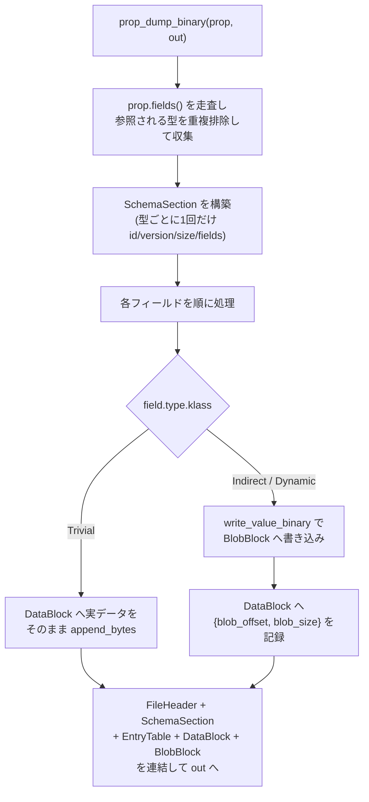
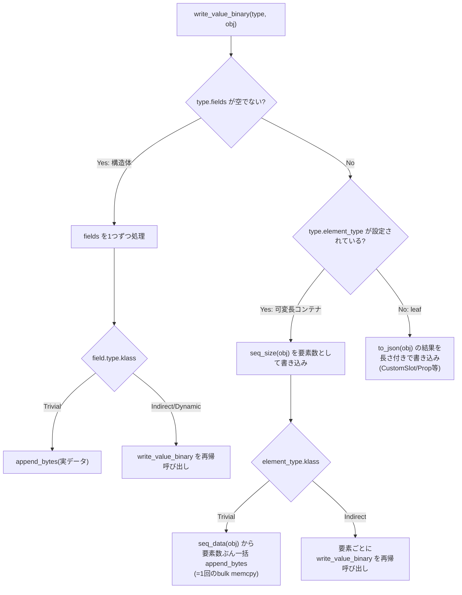
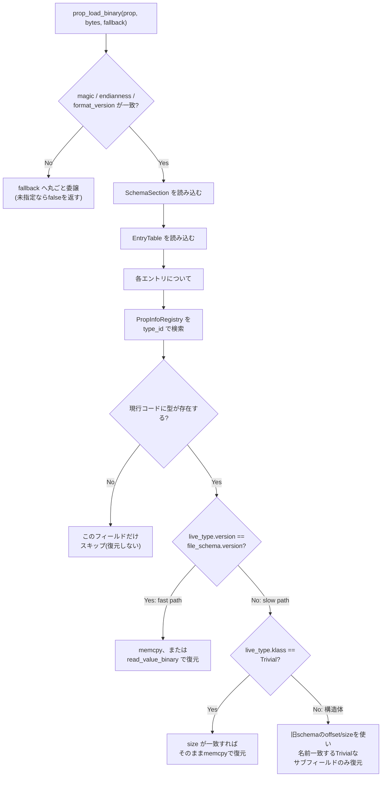
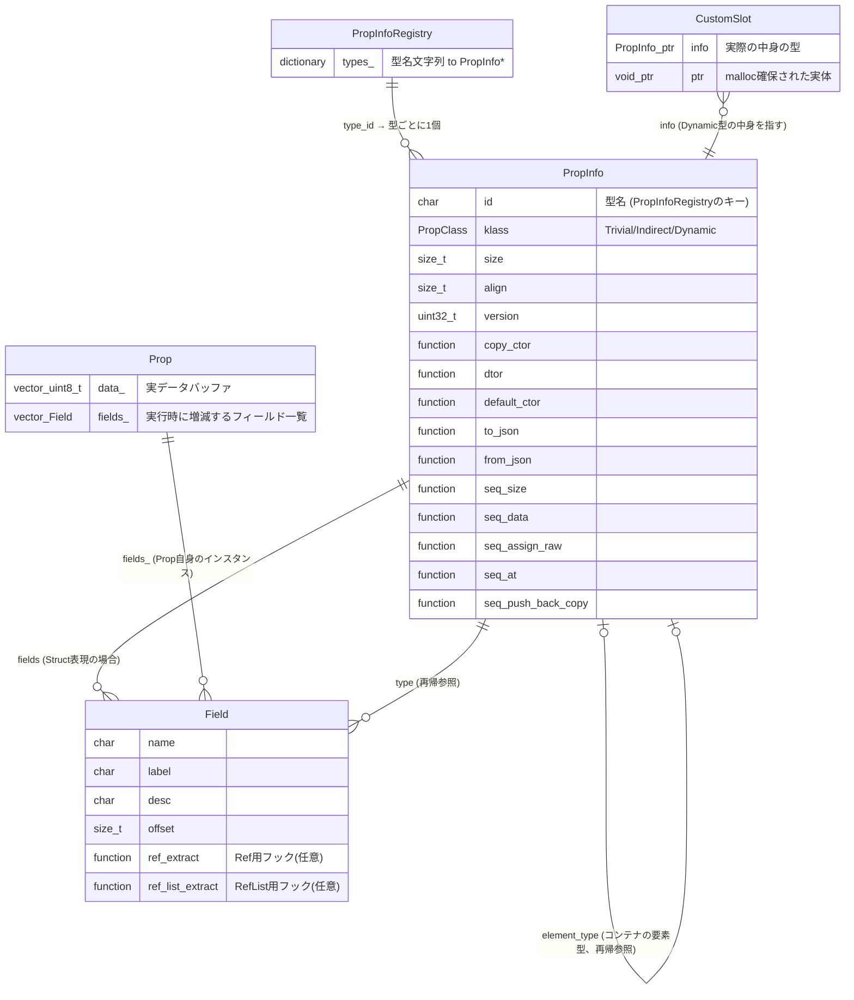
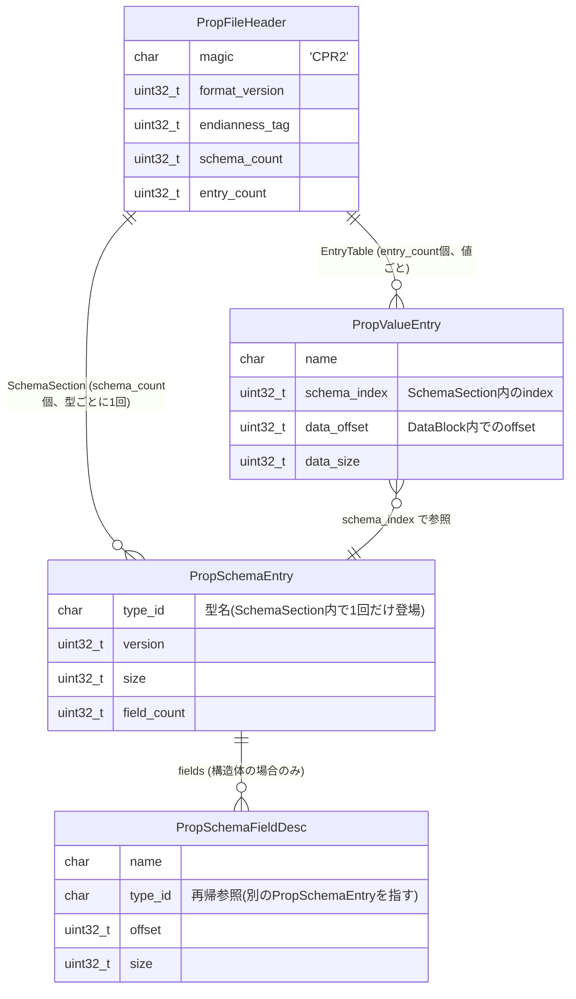

# Prop / PropInfo の使い方

`cutil::Prop` / `cutil::PropInfo` は Blender の DNA/RNA に相当するシリアライズシステムです。
`Prop`(DNA相当)は生バイナリバッファとフィールド一覧を持つ動的プロパティコンテナ、
`PropInfo`(RNA相当)は「1つの型を完全に記述する自己再帰的なノード」です。

旧設計は「フィールドメタデータ(`PropInfo::Data`)」と「型消去された操作テーブル(`CustomTypeOps`/
`CustomTypeRegistry`)」という、同じ「型を記述する」役割を持つ2系統のクラスに分かれていました。
現在は`PropInfo`1クラスへ統合され、型ごとに1回だけ生成される`PropInfo`が、コピー構築/破棄/JSON化/
フィールド一覧/可変長配列アクセサをすべて自己記述します。

対象ファイル:

- `cutil/prop_registry.hpp` — `PropInfo`本体、`PropClass`、`prop_info_of<T>()`、`PropInfoRegistry`、`CustomSlot`
- `cutil/prop.hpp` — `Prop`本体
- `cutil/prop_io.hpp` — JSON/バイナリでのdump/load(ファイルI/O相当)
- `tests/entity.hpp` — `Model`/`Mesh`を使った実装例

## 1. 基本: Propを動的プロパティバッグとして使う

`Prop`はキー(名前)と値のペアを持つ辞書のように使えます。`prop_info_of<T>()`が定義されている型なら
何でも`set`/`get`できます(組み込み型は`prop_registry.hpp`が用意済み、独自構造体は後述のパターンで追加)。

```cpp
#include <cutil/prop.hpp>
using namespace cutil;

Prop p;
p.set<int32_t>("hp", 100);
p.set<float>("speed", 3.5f);
p.set<Vec3f>("pos", Vec3f(1, 2, 3));
p.set<Str>("name", Str("player"));

int32_t hp = p.get<int32_t>("hp");
bool has_name = p.contains("name");
p.erase("hp");

// 子Propとして階層構造を持たせることもできる
Prop child;
child.set<int32_t>("level", 1);
p.set_child("stats", child);
Prop& stats = p.get_child("stats");
```

`set<T>()`と同じ型で再度`set`すると値が上書きされ、違う型で呼ぶと例外(`std::logic_error`)になります。

## 2. PropClass の3分類: Trivial / Indirect / Dynamic

`PropInfo::klass`が、その型をどうシリアライズするかを決めます。

| klass | 意味 | 例 |
|---|---|---|
| `Trivial` (A) | `std::is_trivially_copyable_v`。memcpyだけで完結 | `bool`/`int32_t`/`float`/`Vec3f`/純POD構造体 |
| `Indirect` (B) | サイズは固定だがヒープ領域への間接参照を持つ | `Str`/`Path`/`std::vector<uint8_t>`/`uiVector<T>`/`std::vector<T>`/offsetof構造体 |
| `Dynamic` (C) | サイズ不定形、dict/jsonでしかシリアライズできない | `CustomSlot`経由の任意型 |

klassの判定はコンパイル時の`is_trivially_copyable_v<T>`のみで機械的に行います(fieldsを再帰的に
見て判定するような複雑なロジックは持ちません)。ユーザー定義のTrivial構造体もこれで自動的にAへ
分類されます。

Indirect型は入れ子にできます。例えば`uiVector<Vertex>`(VertexはTrivial)は「B-in-A」、
`std::vector<Model3D>`(Model3DはStr nameを含むIndirect)は「B-in-B」です。B-in-Bの場合、
`uiVector<T>`はmalloc/memcpyベースで要素の移動コンストラクタを呼ばない実装のため、
**非trivial要素を持つコンテナには`uiVector<T>`ではなく`std::vector<T>`を使ってください**
(`uiVector<T>`の`prop_info_of`は`static_assert(is_trivially_copyable_v<T>)`で弾かれます)。

## 3. PropInfo の構造

```cpp
struct PropInfo {
  char id[32];             // 型名。PropInfoRegistryのキーと一致させる
  PropClass klass;
  size_t size, align;
  uint32_t version;        // 型スキーマ全体のバージョン(per-fieldではなく型単位)

  void (*copy_ctor)(void*, const void*);
  void (*dtor)(void*);
  void (*default_ctor)(void*);
  std::string (*to_json)(const void*);
  bool (*from_json)(void*, const std::string&);

  struct Field {
    char name[32], label[64], desc[256];
    size_t offset;
    const PropInfo* type;  // 旧PropType enumの代わり。組み込み/ユーザー型を同じ木で辿れる
    // Ref/RefList用フックもここに残る(次段階でPropInfoRegistry化予定)
  };
  std::vector<Field> fields; // 空 = leaf型 or 可変長コンテナ

  // 可変長コンテナ用アクセサ(配列は最大1本まで)
  const PropInfo* element_type;
  size_t (*seq_size)(const void*);
  const void* (*seq_data)(const void*);              // element Trivial限定、一括memcpy用
  void (*seq_assign_raw)(void*, const void*, size_t); // element Trivial限定、一括memcpy用
  const void* (*seq_at)(const void*, size_t);         // element Indirect用
  void (*seq_push_back_copy)(void*, const void*);     // element Indirect用
};
```

`Field::type`が`const PropInfo*`への参照になったことで、組み込み型もユーザー定義型も同じ木構造で
再帰的に辿れます(旧`PropType` enumは廃止)。

## 4. 外部C++構造体との相互変換: dump() / load_to()

任意のC++構造体を`Prop`と相互変換したい場合、`offsetof`ベースの「ルール」を型ごとに一度だけ静的に作ります。
`dump()`/`load_to()`のrule引数として使うだけなら、`PropInfo(std::initializer_list<Field>)`の
軽量コンストラクタで十分です(klass/copy_ctorは使わない):

```cpp
struct Model3D {
  Vec3f pos;
  Str name;
  bool visible = false;
};

const PropInfo& Model3DInfo() {
  static const PropInfo rule = {
      {"pos", offsetof(Model3D, pos), prop_info_of<Vec3f>()},
      {"name", offsetof(Model3D, name), prop_info_of<Str>()},
      {"visible", offsetof(Model3D, visible), prop_info_of<bool>()},
  };
  return rule;
}

Model3D a;
a.pos = Vec3f(1, 2, 3);

Prop p;
p.dump(&a, &Model3DInfo());       // 構造体 → Prop

Model3D b;
p.load_to(&b, &Model3DInfo());    // Prop → 構造体(bへ復元)
```

Indirect/Dynamic型のフィールドは、`Prop`側にライブオブジェクトとして`copy_ctor`(placement-new)で
構築され、`load_to()`では既存オブジェクトを`dtor`で破棄してから`copy_ctor`で再構築します。

`Model3D`型自身を`Prop::set<Model3D>()`/`get<Model3D>()`のように直接使いたい場合や、可変長コンテナ
(`std::vector<Model3D>`)のフィールドとして入れ子にしたい場合は、`prop_info_of<Model3D>()`が解決できる
必要があります。そのためには`register_struct_type<T>()`で完全な型登録(klass自動判定・copy_ctor/
dtor/to_json/from_jsonの自動生成)を行い、`PropInfoOf<T>`を特殊化します:

```cpp
namespace cutil {
template <> struct PropInfoOf<Model3D> {
  static const PropInfo* get() {
    return register_struct_type<Model3D>("Model3D", {
        {"pos", offsetof(Model3D, pos), prop_info_of<Vec3f>()},
        {"name", offsetof(Model3D, name), prop_info_of<Str>()},
        {"visible", offsetof(Model3D, visible), prop_info_of<bool>()},
    });
  }
};
}
```

これで`prop_info_of<Model3D>()`や`prop_info_of<std::vector<Model3D>>()`がそのまま使えるようになります
(`std::vector<T>`の汎用テンプレートが`T`のklassに応じて一括memcpyまたは要素ごとの再帰を自動選択します)。

## 5. 参照フィールド(Ref<T> / vector<Ref<T>>)を扱う

シーングラフのようにオブジェクト同士が`cutil::Ref<T>`/`cutil::WeakPtr<T>`で参照し合っている場合、
参照先の実体をコピーするのではなく「生きたポインタ」だけを`Prop`に持たせたいことがあります。
これを`PropInfo::Field::make_ref<T>()`(単一参照)・`make_ref_list<T>()`(複数参照)で実現します
(次段階まで現状のシグネチャのまま温存している機能です)。

```cpp
PropInfo::Field::make_ref<Model>("parent", offsetof(Model, parent));          // WeakPtr<Model> 用
PropInfo::Field::make_ref_list<Mesh>("meshes", offsetof(Model, meshes));      // vector<Ref<Mesh>> 用
```

- dump時: 参照先の生ポインタ(`T*`)を`Prop`のバッファへ格納する。
- load_to時: 格納された生ポインタから`T::weak_from_this()`/`ref_from_this()`(`enable_ref_from_this<T>`のAPI)を
  使って正規の`WeakPtr<T>`/`Ref<T>`を再構築する。

**重要な制約**: ここで保持されるのは生のメモリアドレスです。同一プロセス内で参照先オブジェクトが
生きている間だけ有効な「ライブスナップショット」であり、ファイルへdump/loadしてプロセスをまたいで
復元しても意味を持ちません(詳細はセクション8)。

## 6. get_propinfo() パターンと dump()/load() ラッパー

自分の型に対して、上記の「ルール」を`static const PropInfo* get_propinfo()`という静的メンバ関数として
持たせておくと、呼び出し側はルールを意識せず使えます。`tests/entity.hpp`の`Model`/`Mesh`が実装例です。

```cpp
class Mesh final : public enable_ref_from_this<Mesh> {
public:
  int vertex_count = 0;

  static const PropInfo* get_propinfo() {
    static const PropInfo rule = {
        {"vertex_count", offsetof(Mesh, vertex_count), prop_info_of<int32_t>()},
    };
    return &rule;
  }

  Prop dump() const { Prop p; p.dump(this, get_propinfo()); return p; }
  bool load(const Prop& p) { return p.load_to(this, get_propinfo()); }
};
```

```cpp
auto mesh = Mesh::Create(42);
Prop p = mesh->dump();

auto restored = Mesh::Create(0);
restored->load(p);
// restored->vertex_count == 42
```

## 7. Custom(Dynamic)型の登録

サイズが不定形、または内部構造をcutil側に教えられない任意の型(python objectなど)は、
`register_dynamic_type<T>()`でDynamic型として登録します(旧`register_custom_type<T>`の後継)。

```cpp
std::string video_to_json(const void* obj) { ... }
bool video_from_json(void* obj, const std::string& json) { ... } // placement-newで構築する規約

register_dynamic_type<VideoClip>("VideoClip", video_to_json, video_from_json);

Prop p;
p.set_custom("intro", "VideoClip", VideoClip("intro.mp4", 60));
VideoClip& clip = p.get_custom<VideoClip>("intro");
```

## 8. カスタムエンジンでのプロジェクト保存(`cutil/prop_io.hpp`)

`Prop`をファイルへ保存・復元するには`prop_io.hpp`のヘルパーを使います。2系統あります。

### JSON(可読・フォールバック用)

```cpp
#include <cutil/prop_io.hpp>

std::string json_text;
prop_dump_json(prop, json_text);   // 各フィールドのto_json()を呼ぶだけ(型ごとのswitch分岐は不要)

Prop loaded;
prop_load_json(loaded, json_text); // 各フィールドのtype_idをPropInfoRegistryで引き直しfrom_json()で復元
```

### バイナリ(高速・本番用)

```cpp
std::vector<uint8_t> bytes;
prop_dump_binary(prop, bytes);

Prop loaded;
prop_load_binary(loaded, bytes);
```

新フォーマットは型ごとに1回だけ`[SchemaSection]`へスキーマを記録し、値側の`[EntryTable]`は
名前+スキーマ参照+offset/sizeのみの軽量レコードにします(旧設計は値ごとに約500バイトの
フィールドメタデータを毎回書いていました)。Trivial要素の配列は1回のbulk memcpyで、Indirect要素は
要素ごとに再帰してdump/loadします。**旧設計の「JsonBlockをファイル全体に常時併載する」仕様は廃止**
しました。Dynamic型は各エントリの`[BlobBlock]`内に個別にjsonを持つのみです。

実測(`uiVector<Vertex>`/`std::vector<Model3D>`、JSON比のバイナリサイズ):

| 件数 | uiVector\<Vertex\> (B-in-A) | std::vector\<Model3D\> (B-in-B) |
|---|---|---|
| 10 | 0.52x | 0.65x |
| 100 | 0.39x | 0.46x |
| 1,000 | 0.37x | 0.45x |
| 10,000 | 0.37x | 0.45x |

load速度もバイナリがJSON比で100倍以上高速です(10,000件で0.06ms vs 128ms、0.45ms vs 86ms)。

### フローチャート: prop_dump_binary の処理



`write_value_binary` 自体は型の形に応じて3方向に分岐し、Indirect-in-Indirect(B-in-B)は自分自身を
再帰呼び出しします:



読み込み側は `SchemaSection` に記録された version とプロセス内の現在の型定義の version を比較し、
一致すれば高速パス、不一致ならエントリ単位のフォールバックへ分岐します:



### ER図: PropInfo の型グラフ

`PropInfo::Field::type` が `const PropInfo*` への自己参照になったことで、組み込み型もユーザー定義型も
同じ木構造として辿れます。`element_type` はコンテナの要素型を指す、もう1つの自己参照です。



### ER図: バイナリファイル構造



`DataBlock`/`BlobBlock` はこの2つのテーブルに続くバイト列で、`PropValueEntry.data_offset`と
`PropSchemaFieldDesc.offset`がそれぞれの位置を指します(スキーマ自体はエンティティを持たない生バイト列
なので上のER図には含めていません)。

### バージョン一致/不一致の挙動

```cpp
prop_load_binary(prop, bytes, fallback); // fallback省略可
```

- ファイルに記録された型のversionと、現在のプロセスの`PropInfoRegistry`上の型のversionが一致すれば、
  memcpy一発(Indirectはヘッダmemcpy+一括データmemcpy、または要素ごと再帰)で高速に復元します(fast path)。
- 一致しない場合は**型(エントリ)単位のフォールバック**が働きます。Trivial型はバイナリレイアウト
  (`size`)が変わっていなければそのままmemcpyで復元、構造体(Indirect、fieldsを持つ型)は旧schemaの
  offset/sizeを使ってTrivialサブフィールドのみ名前一致で復元します(Indirect/Dynamicなサブフィールドの
  変更までは次段階)。同じProp内の他のフィールドは影響を受けず引き続きfast pathで処理されます。
- ファイルのmagic/endianness/format_versionが不一致、またはデータが壊れている場合のみ、
  Prop全体を`fallback`コールバックに委譲します(明示的に渡さなければ`false`を返します)。

旧設計は「フィールド単位で検知するがフォールバックはProp全体」という非対称な粒度でしたが、
新設計では**フォールバック粒度が型(PropInfoノード)単位に統一**されています。

### 注意: 参照フィールド(Ref/RefList)はファイル保存には向かない

`PropInfo::Field`の`ref_extract`/`ref_list_extract`が設定されたフィールドは生ポインタをそのまま
値として保持するため、`prop_dump_json`/`prop_dump_binary`でファイルへ書き出すこと自体は失敗しませんが、
別プロセス・別実行で読み込んでもアドレスは無意味になります。永続化したい場合は、各オブジェクトに
一意なIDを持たせてRefの代わりにID(整数)をフィールドとして持たせ、load後に自前でID→オブジェクトの
解決を行う設計にする必要があります(`tests/test_entt_prop.cpp`の`EnttScene::model_ids`が実例です)。
